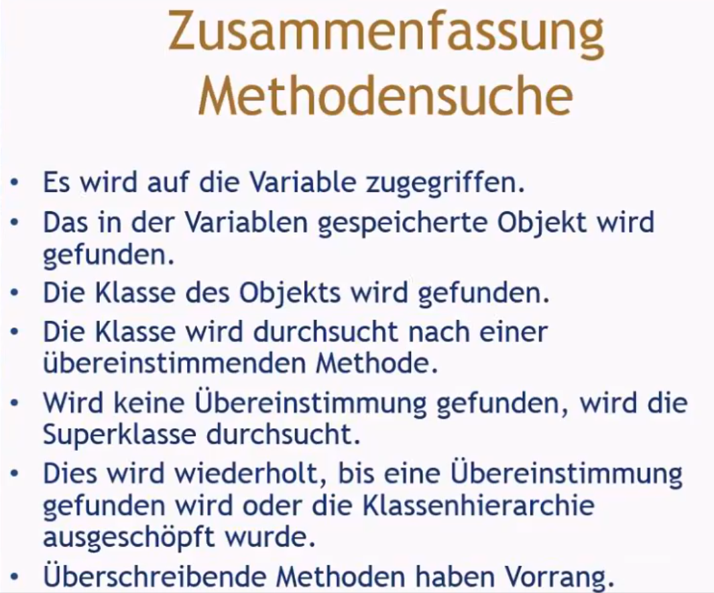
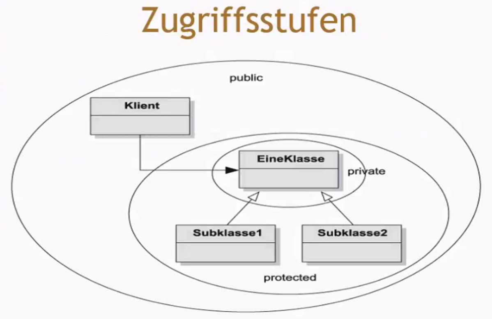
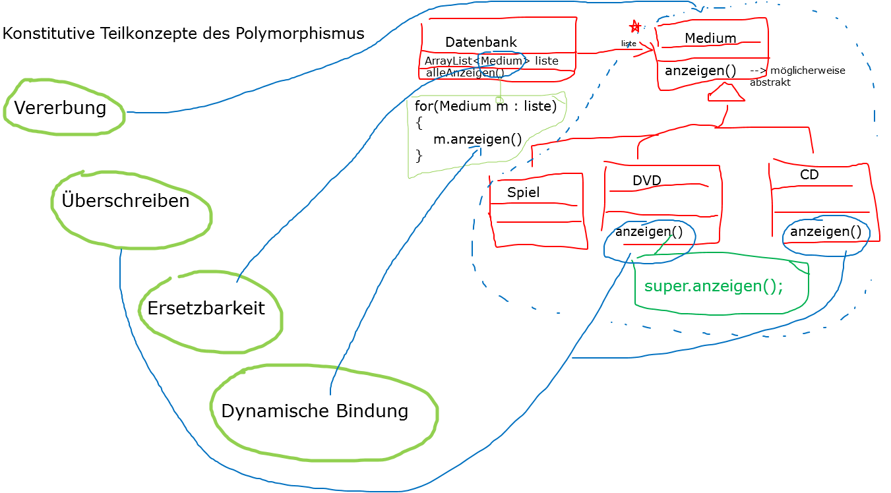

## (26.09.2024) Das ist das Tagbuch vom 2. Modul
- Ich habe die Videos und die Bilder angeschaut und habe die Theorie zu Polymorphismus gelernt!
- Außderm habe ich die Teilbereiche angeschaut und diese ebenfalls gelernt!

## Hier nochmal die wichtigsten Punkte zum 1. Video:
- Es wird als Beispiel das DoME Beispiel verwendet.
- Es gibt zwei Klasse: Einmal die Klasse CD und einmal die Klasse DVD.
- Die Datenbank enthält zwei Array-Lists: einmal cds und einmal dvds.
- Die Kritik am DoME-Beispiel ist einmal die Code-Duplizierung und einmal die Code Duplizierung auch in der Klasse Datenbank.
- Die Klassen CD und DVD erben alle Methoden von Mdeium und können außderm noch zusätzliche Methoden dazu definieren.
- Bei der Vererbung in Java ändert sich in der Mutterklasse nichts und in den ableitenen Klassen folgt das Schlüsselwort extends.
- Im Konstruktor von CD müssen alle Parameter enthalten sein, die auch in der Mutterklasse Medium enthalten sind.
- Dort muss auch ein Aufruf des Konstruktors der Superklasse enthalten sein und dieser muss aber auch die erste Anweisung im Konstruktor sein.
- 2 bis 3 Hierarchiestufen sind okay, aber danach wird es unübersichlich.
- Objekte von Subklassen können verwendet werden, wo Objekte eines Supertyps erwartet werden. Das nennt man auch Ersatzbarkeit.
- Objektvariablen in Java sind polymorph.
- Man kann Objekte des deklarierten Typs oder von Subtypen des deklarierten Typs halten.
- Man kann Subtypen an einen Supertyp zuweisen, aber man kann nicht einen Supertyp an einen Subtyp zuweisen.
- Der Cast-Operator ist ein Objekttyp in Klammern und er wird verwendet, um dem 'Verlust an Typinformationen' entgegenzuwirken, dabei wird das Objekt nicht geändert. 
- Zur Laufzeit wird geprüft, ob das Objekt wirklich vom angegebenen Typ ist: ClassCastException wenn nicht.
- Außerdem sollte man den Cast-Operator möglichst sparsam verwenden.

### Rückblick im 1. Video:
- Vererbung erlaubt die Definition von Klassen als Erweiterung von anderen Klassen.
- Vererbung vermeidet Code-Duplizierung.
- Vererbung erlaubt die Wiederverwendung von Code.
- Vererbung vereinfacht den Code.
- Vererbung vereinfacht die Wartung und die Erweiterung.
- Variablen können Objekte von Subtypen halten. 
- Subtypen können immer dann verwendet werden, wenn Objekte von Supertypen erwartet werden (Ersetzbarkeit).

## Zum 2. Videos die wichtigsten Punkte:
- Die zentralen Konzepte sind die Methoden-Polymorphie, Statischer und dynamischer Typ, Überschreiben von Methoden, Dynamische Methodensuche und der Zugriff über protected.
- Vererbungshierarchie: Die Datenbank hat nur Zugriff auf das Medium, aber nicht auf CD oder DVD.
- Das Problem ist, dass die Methode "ausgeben" in Medium nur die gemeinsamen Datenfelder ausgibt.
- Der deklarierte Typ einer Variablen ist ihr statischer Typ.
- Der Typ des Objekts, auf das eine Variable verweist, ist ihr dynamischer Typ.
- Der Compiler hat die Aufgabe, zu schauen, wo der statische Typ verletzt wird.
- Um das Problem zu lösen, muss man mit der Subklassenmethoden die Version der Superklasse überschrieben.

- Wenn man toString überschreibt, dann kann auf explizite ausgeben-Methoden oftmals verzichten.
- Aufrufe von println mit einem Objekt führen automatisch dazu, dass toString aufgerufen wird.

### Rückblick im 2. Video:
- Der deklarierte Typ einer Variablen ist ihr statischer Typ.
- Compiler prüfen statische Typen.
- Der Typ eines Objekts ist sein dynamischer Typ.
- Dynamische Typen werden zur Laufzeit verwendet.
- Methoden können in einer Subklasse überschrieben werden.
- Methodensuche beginnt mit dem dynamischen Typ. 
- Zugriff über protected unterstützt Vererbung.

## Hier nochmal die wichtigsten Punkte zum 3. Video:
- Konstitutive Teilkonzepte des Methodenmorphismus: Vererbung, Überschreiben von Methoden, Ersatzbarkeit, Dynamische Bindung, 

